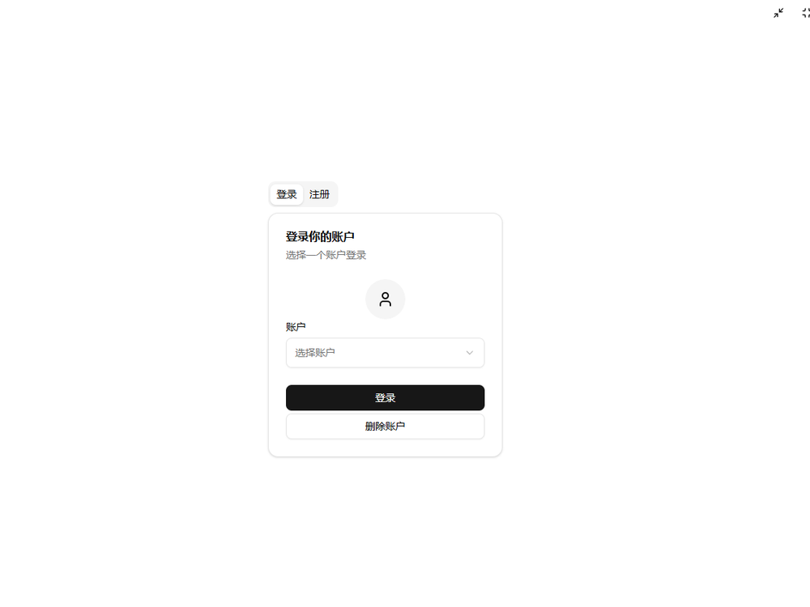

# Pupu

[中文](docs/zh/README.md)

A cross-platform network chat application built on modern web technologies. It can be used directly as a web application or packaged as a native desktop application, providing users with a secure, efficient, and smooth communication experience.

## ✨ Core Advantages

- **True Cross-Platform Experience** - Seamlessly supports Web and Windows with consistent, fluid user experience
- **Instant Web Application** - No installation required; simply access **[Pupu](https://pupu.zhangxichang.com)** through your browser to start using
- **High-Performance Rust Backend** - Core application components (WebAssembly modules and native backend) written in Rust, combining excellent performance with memory safety
- **Distributed P2P Communication** - Utilizes the Kademlia protocol to build a distributed network, ensuring reliable user connectivity

## ⬇️ Download Options

- **[GitHub Release](https://github.com/ZhangXiChang/pupu/releases)** - Primary distribution channel for international users
- **[Gitee Release](https://gitee.com/zhangxichang/pupu-release-latest/releases)** - Faster download experience for users in China

## 📚 Documentation & Architecture

We recommend using [Obsidian](https://obsidian.md) to open project documentation, as some documents require this tool for proper rendering.

- [Project Architecture Design](docs/zh/PROJECT_ARCH.md) - Detailed analysis of system design and technology choices
- [Developer Guide](docs/zh/DEVELOPER_GUIDE.md) - Quick start guide for development environment setup and build processes

## 🤝 Contribute

We sincerely welcome contributions of all kinds! Whether it's code submissions, documentation improvements, or issue reports, your participation helps make Starlink better. For detailed contribution procedures, please refer to the [Contribution Guide](docs/CONTRIBUTING.md).

## 💬 Feedback & Suggestions

Your feedback drives our progress! We look forward to your valuable input:

- 🐞 **Report Issues**: [Submit a Bug](https://github.com/ZhangXiChang/pupu/issues/new?template=you-encountered-a-bug-.md)
- 💡 **Feature Requests**: [Suggest New Features](https://github.com/ZhangXiChang/pupu/issues/new?template=you-have-an-improvement-idea-.md)
- 💬 **Community Discussion**: Join our discussion area to share experiences with other users
